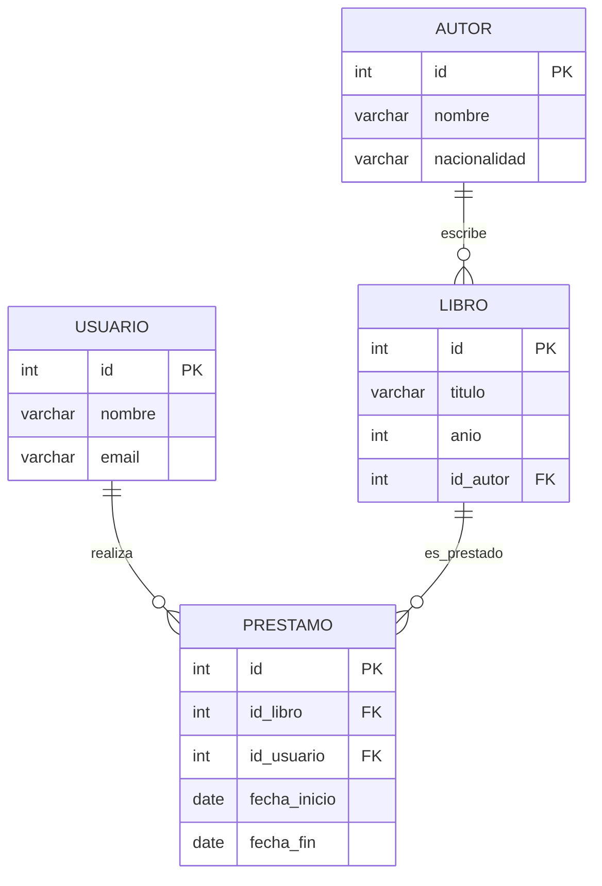

# Clase 1: Fundamentos de Bases de Datos y Diseño Relacional

Esta clase introduce los conceptos esenciales de bases de datos con foco en el modelo relacional y PostgreSQL. Incluye teoría, ejemplos prácticos y un ejercicio guiado. Al final tendrás un script SQL ejecutable para crear un esquema de biblioteca.
 
- Archivo SQL asociado: `Clase 1/clase1_biblioteca.sql`
- Objetivo: comprender conceptos, instalar/usar un entorno, diseñar un modelo ER y crear tablas con restricciones.

## Índice

- [1. Introducción al concepto de base de datos](#1-introducción-al-concepto-de-base-de-datos)
- [2. Entorno de trabajo](#2-entorno-de-trabajo)
- [3. Fundamentos del modelo relacional](#3-fundamentos-del-modelo-relacional)
  - [3.3 Tipos de relaciones (tabla)](#33-tipos-de-relaciones-tabla)
  - [3.6 Restricciones básicas (tabla)](#36-restricciones-básicas-tabla)
- [4. Tipos de datos en PostgreSQL](#4-tipos-de-datos-en-postgresql)
  - [Resumen de tipos (tabla)](#resumen-de-tipos-tabla)
- [5. Diseño ER: Sistema de biblioteca](#5-diseño-er-sistema-de-biblioteca)
- [6. Uso de IA como asistente](#6-uso-de-ia-como-asistente)
- [7. Actividad práctica guiada](#7-actividad-práctica-guiada)
- [Cómo ejecutar](#cómo-ejecutar)
- [Recursos](#recursos)

## 1. Introducción al concepto de base de datos

### 1.1 Conceptos básicos
- Base de Datos (BD): colección organizada de datos relacionados para consulta y actualización eficiente y confiable.
- Sistema Gestor de Bases de Datos (SGBD/DBMS): software que administra BD (seguridad, concurrencia, transacciones). Ej.: PostgreSQL.
- SQL: lenguaje estándar para definir y consultar datos en sistemas relacionales (DDL, DML, DCL, TCL).

Glosario mínimo:
- DDL: Data Definition Language (CREATE, ALTER, DROP)
- DML: Data Manipulation Language (SELECT, INSERT, UPDATE, DELETE)
- DCL: Data Control Language (GRANT, REVOKE)
- TCL: Transaction Control Language (BEGIN, COMMIT, ROLLBACK)

### 1.2 Modelos de bases de datos

| Modelo | Organización | Fortalezas | Ejemplos |
|---|---|---|---|
| Relacional (SQL) | Tablas (filas/columnas) con claves y relaciones | Integridad, consultas complejas (JOINs), transacciones ACID | PostgreSQL, MySQL, SQL Server |
| Documento (NoSQL) | Documentos (JSON) por colección | Flexibilidad de esquema, evolución rápida | MongoDB, CouchDB |
| Clave-valor (NoSQL) | Pares key→value | Velocidad, caché, sencillez | Redis, DynamoDB (modo KV) |
| Columna ancha (NoSQL) | Column families | Escalabilidad horizontal, analítica | Cassandra, HBase |
| Grafos (NoSQL) | Nodos y aristas | Relaciones y caminos complejos | Neo4j, JanusGraph |

### 1.3 ¿Por qué relacional para esta clase?
- Integridad referencial: evita huérfanos y mantiene coherencia.
- Normalización: minimiza redundancia y anomalías.
- SQL: expresivo y estándar, ideal para aprender consultas y diseño.
- Transaccionalidad ACID: operaciones confiables bajo concurrencia.

Resumen ACID:

| Propiedad | Significado | Ejemplo práctico |
|---|---|---|
| Atomicidad | Todo o nada | Insert de préstamo y actualización de stock se aplican juntos o ninguno |
| Consistencia | Estado válido antes y después | CHECK de fechas y FKs siempre válidos |
| Aislamiento | Transacciones no se pisan entre sí | Lecturas no ven cambios no confirmados |
| Durabilidad | Cambios persisten tras COMMIT | Datos sobreviven a reinicios del servidor |

### 1.4 Casos de uso y modelo recomendado

| Caso | Relacional | No relacional |
|---|---|---|
| Finanzas/banca | ✔ Fuerte consistencia, auditoría | ✖ |
| eCommerce | ✔ Órdenes, pagos, inventario | Documentos para carrito/catálogos |
| Analítica/Logs | Vistas materializadas + BI | ✔ Columnar/clave-valor para ingesta |
| Redes sociales | Relaciones complejas (amigos) | ✔ Grafos para recomendaciones |

### 1.5 Ecosistema de PostgreSQL
- Motor relacional avanzado, open source, con tipos ricos (JSONB, ARRAY, ENUM) y extensiones.
- Extensiones destacadas: PostGIS (geoespacial), pg_trgm (búsquedas), pg_partman (particiones), uuid-ossp/pgcrypto (UUIDs).
- Herramientas cliente: psql (CLI), pgAdmin (GUI), DBeaver (multi-SGBD), Azure Data Studio.
- Despliegue: local, contenedores (Docker), PaaS (Railway, Supabase, RDS/Aurora).

## 2. Entorno de trabajo
 
### 2.1 Instalación local de PostgreSQL

- Descarga e instala desde: https://www.postgresql.org/download/ (incluye pgAdmin y psql).

### 3.6 Restricciones básicas
- Tabla resumen de restricciones comunes:

| Restricción | Qué asegura | Ejemplo | Cuándo usar |
|---|---|---|---|
| NOT NULL | El valor no puede ser nulo | `titulo VARCHAR(200) NOT NULL` | Atributos obligatorios |
| UNIQUE | No se repiten valores | `email VARCHAR(255) UNIQUE` | Identificadores naturales (email, DNI) |
| CHECK | Regla booleana a nivel de fila | `CHECK (anio BETWEEN 0 AND EXTRACT(YEAR FROM CURRENT_DATE)::INT)` | Rangos, formatos, coherencia |
| DEFAULT | Valor por defecto si no se especifica | `fecha_inicio DATE DEFAULT CURRENT_DATE` | Timestamps de creación, flags |
| PRIMARY KEY | Identificador único + índice | `id BIGSERIAL PRIMARY KEY` | Identificar filas |
| FOREIGN KEY | Integridad referencial entre tablas | `FOREIGN KEY (id_autor) REFERENCES autor(id)` | Modelar relaciones |

Ejemplos rápidos:

```sql
-- PK + NOT NULL
CREATE TABLE ejemplo_pk (
  id BIGSERIAL PRIMARY KEY,
  nombre VARCHAR(100) NOT NULL
);

-- FK + CHECK
CREATE TABLE ejemplo_fk (
  id BIGSERIAL PRIMARY KEY,
  ejemplo_pk_id BIGINT NOT NULL REFERENCES ejemplo_pk(id),
  porcentaje NUMERIC(5,2) CHECK (porcentaje BETWEEN 0 AND 100)
);
```

### 3.7 Normalización (1FN, 2FN, 3FN)
- 1FN: valores atómicos sin listas ni repetidos por celda.
- 2FN: sin dependencias parciales de una PK compuesta.
- 3FN: sin dependencias transitivas (no atributos derivados de otros no-clave).

## 4. Tipos de datos en PostgreSQL


### Resumen de tipos (tabla)

| Categoría | Tipo(s) comunes | Descripción/uso | Ejemplo |
|---|---|---|---|
| Numéricos | `SMALLINT`, `INTEGER`, `BIGINT`, `NUMERIC(p,s)`, `SERIAL/BIGSERIAL` | Conteos, identificadores, montos (usar NUMERIC para dinero/precisión) | `precio NUMERIC(12,2)` |
| Texto | `VARCHAR(n)`, `TEXT` | Cadenas; `VARCHAR` para longitudes acotadas, `TEXT` para largas | `titulo VARCHAR(200)` |
| Fecha/Hora | `DATE`, `TIME`, `TIMESTAMP [WITH TIME ZONE]` | Fechas y momentos; preferir `TIMESTAMP WITH TIME ZONE` si importa TZ | `creado_en TIMESTAMP WITH TIME ZONE` |
| Booleano | `BOOLEAN` | Verdadero/Falso | `es_activo BOOLEAN DEFAULT TRUE` |
| Otros útiles | `UUID`, `JSONB`, `ARRAY`, `ENUM` | Según necesidad avanzada | `id UUID DEFAULT gen_random_uuid()` |

## 5. Diseño ER: Sistema de biblioteca

### 5.1 Requisitos y alcance
Queremos gestionar un catálogo de libros, sus autores y los préstamos realizados por usuarios. Reglas clave:

- Registrar autores, libros y usuarios de forma única (sin duplicados evidentes).
- Cada libro pertenece a un único autor (en este modelo base).
- Un préstamo enlaza un libro con un usuario, con fecha de inicio y (opcionalmente) fecha de fin.
- No permitir inconsistencias: autores/libros/usuarios inexistentes, fechas inválidas, emails mal formados.

### 5.2 Diccionario de datos (base)

Entidad AUTOR

| Columna | Tipo | Nulo | PK | FK | Restricciones |
|---|---|---|---|---|---|
| id | BIGSERIAL | NO | Sí |  |  |
| nombre | VARCHAR(150) | NO |  |  |  |
| nacionalidad | VARCHAR(100) | Sí |  |  | UNIQUE(nombre, nacionalidad) |

Entidad LIBRO

| Columna | Tipo | Nulo | PK | FK | Restricciones |
|---|---|---|---|---|---|
| id | BIGSERIAL | NO | Sí |  |  |
| titulo | VARCHAR(200) | NO |  |  |  |
| anio | INT | Sí |  |  | CHECK (anio BETWEEN 0 AND año actual) |
| id_autor | BIGINT | NO |  | autor(id) | ON UPDATE CASCADE, ON DELETE RESTRICT |

Entidad USUARIO

| Columna | Tipo | Nulo | PK | FK | Restricciones |
|---|---|---|---|---|---|
| id | BIGSERIAL | NO | Sí |  |  |
| nombre | VARCHAR(150) | NO |  |  |  |
| email | VARCHAR(255) | NO |  |  | UNIQUE, CHECK (contiene '@') |

Entidad PRESTAMO

| Columna | Tipo | Nulo | PK | FK | Restricciones |
|---|---|---|---|---|---|
| id | BIGSERIAL | NO | Sí |  |  |
| id_libro | BIGINT | NO |  | libro(id) | ON UPDATE CASCADE, ON DELETE RESTRICT |
| id_usuario | BIGINT | NO |  | usuario(id) | ON UPDATE CASCADE, ON DELETE RESTRICT |
| fecha_inicio | DATE | NO |  |  | DEFAULT CURRENT_DATE |
| fecha_fin | DATE | Sí |  |  | CHECK (fecha_fin >= fecha_inicio) o NULL |

Notas:
- Las tablas y restricciones corresponden al script `Clase 1/clase1_biblioteca.sql`.
- El `CHECK` de año se implementa comparando con el año de la fecha actual en PostgreSQL.

### 5.3 Relaciones y cardinalidad

| Origen | Relación | Destino | Cardinalidad | Implementación |
|---|---|---|---|---|
| AUTOR | escribe | LIBRO | 1:N | `LIBRO.id_autor` FK → `AUTOR.id` |
| USUARIO | realiza | PRESTAMO | 1:N | `PRESTAMO.id_usuario` FK → `USUARIO.id` |
| LIBRO | es_prestado | PRESTAMO | 1:N | `PRESTAMO.id_libro` FK → `LIBRO.id` |

### 5.4 Diagrama ER

Vista renderizada (imagen):


Fuente PlantUML: [diagrama_er_biblioteca.puml](./diagrama_er_biblioteca.puml)

Versión Mermaid (renderizable en GitHub/VS Code):
 


### 5.5 Decisiones de diseño y normalización
- 3FN: datos atómicos (1FN), sin dependencias parciales (2FN) ni transitivas (3FN).
- No se repite `nombre` del autor dentro de `libro` (evita redundancia y anomalías).
- `anio` es entero con validación; fechas se representan con tipos de fecha (no texto).
- `fecha_fin` puede ser NULL para representar préstamos activos.

### 5.6 Validaciones e índices recomendados
- Índices para rendimiento: `idx_libro_titulo`, `idx_prestamo_usuario`, `idx_prestamo_libro`.
- Coherencia de fechas con `CHECK (fecha_fin IS NULL OR fecha_fin >= fecha_inicio)`.
- Opcional (regla de negocio): evitar dos préstamos activos del mismo libro con un índice único parcial:

```sql
-- Evita más de un préstamo activo por libro (fecha_fin NULL)
CREATE UNIQUE INDEX IF NOT EXISTS uq_prestamo_libro_activo
  ON biblioteca.prestamo (id_libro)
  WHERE fecha_fin IS NULL;
```


## 6. Uso de IA como asistente

La IA puede acelerar el modelado si le das contexto claro y pides verificaciones explícitas. Aun así, la validación final es humana.

### 6.1 Plantillas de prompt (copy/paste)

Prompt inicial breve (descubrimiento):

> Diseña una base de datos relacional en PostgreSQL para una biblioteca con libros, autores y préstamos. Entrega: lista de entidades con atributos y tipos, relaciones con cardinalidad, y justifica PK/FK y restricciones.

Prompt detallado (con restricciones):

> Quiero un modelo ER para una biblioteca (PostgreSQL). Requisitos: 1) Cada libro tiene un único autor. 2) Validar año del libro contra el año actual. 3) Email de usuario único. 4) Préstamo: fecha_inicio obligatoria, fecha_fin opcional y >= fecha_inicio. Devuelve: entidades (tabla con columnas/tipos/PK/FK/NOT NULL/UNIQUE/CHECK), relaciones (tabla con cardinalidades), y recomendaciones de índices.

Prompt para revisión/QA del modelo:

> Revisa este esquema por integridad y normalización 3FN. Señala redundancias, anomalías de actualización, tipos inadecuados y restricciones faltantes. Propón mejoras mínimas y justifícalas.

### 6.2 Resultado esperado de la IA
- Entidades, atributos y tipos sugeridos (con NOT NULL/UNIQUE/CHECK si aplica).
- Relaciones con cardinalidades y dirección de FKs.
- Reglas de negocio reflejadas en restricciones o índices.
- Justificación de decisiones (p. ej., por qué usar INT vs. UUID, o qué índice agregar).

### 6.3 Checklist de validación humana

| Ítem | Qué revisar | OK |
|---|---|:---:|
| PK | Cada tabla tiene PK estable y simple (preferible) |
| FK | Todas las referencias apuntan a la PK correcta con ON DELETE/UPDATE adecuados |
| Restricciones | NOT NULL/UNIQUE/CHECK/DEFAULT reflejan reglas de negocio |
| Tipos | Tipos correctos (fechas como DATE/TIMESTAMP, montos con NUMERIC, etc.) |
| Normalización | Sin datos derivados o redundantes (3FN) |
| Índices | Índices en FK y columnas de búsqueda frecuentes |
| Casos borde | Nulos permitidos donde corresponde; rangos validados |

Ejemplos concretos para este caso:
- ¿`email` es UNIQUE y con CHECK de formato básico?
- ¿`anio` valida contra el año actual?
- ¿`fecha_fin` es NULL o >= `fecha_inicio`?

### 6.4 Flujo iterativo recomendado
1) Describir el dominio y pedir propuesta inicial.
2) Pedir a la IA una auto-revisión (consistencia, 3FN, restricciones faltantes).
3) Revisar manualmente con el checklist y anotar cambios.
4) Iterar con la IA solo en las partes a ajustar; mantener cambios mínimos.
5) Generar script SQL y ejecutarlo; validar con datos de prueba y consultas.

### 6.5 Buenas prácticas y límites
- Sé específico con reglas de negocio y pide restricciones explícitas.
- Pide tablas/resúmenes (como secciones de este README) para escanear rápido.
- Mantén cambios pequeños entre iteraciones para no perder trazabilidad.
- Recuerda: la IA no sustituye pruebas ni validaciones en tu entorno.

### 6.6 Mini ejemplo de interacción

Usuario: “Genera tablas para Autor, Libro, Usuario y Préstamo con PostgreSQL. Incluye PK, FK, UNIQUE(email) y CHECKs de año y fechas.”

IA (esperado): “Entidades: Autor(id, nombre, nacionalidad)... Relaciones: Autor 1:N Libro... Restricciones: CHECK(anio...), UNIQUE(email)... Índices sugeridos: ... Script SQL inicial: ...”

Usuario: “Revisa 3FN y añade un índice para buscar libros por título y para acelerar joins de préstamo.”

IA (esperado): “El modelo cumple 3FN. Sugiero idx_libro_titulo, idx_prestamo_usuario, idx_prestamo_libro y un índice único parcial si se desea impedir préstamos simultáneos del mismo libro.”

## 7. Actividad práctica (entrega)

Enunciado:

Diseña y entrega un pequeño esquema ampliado para la biblioteca que incluya:

- Tablas: `autor`, `libro`, `usuario`, `prestamo` (base) y al menos una de las siguientes extensiones: `copia` (ejemplares) o `categoria` + `libro_categoria` (N:M).
- Restricciones: PK, FK, NOT NULL, UNIQUE y al menos un CHECK relevante.
- Índices recomendados y una consulta de reporte (por ejemplo: libros prestados actualmente, o cantidad de libros por autor).

Pasos (sugeridos):

1) Escribir el diagrama (Mermaid o PlantUML) del modelo final.
2) Crear un script SQL `actividad_clase1.sql` que cree las tablas y restricciones en el esquema `biblioteca`.
3) Insertar datos de ejemplo (mínimo 3 autores, 5 libros, 3 usuarios y 3 préstamos variados).
4) Añadir 2 consultas de verificación/repoteo (por ejemplo: préstamos activos, libros por autor).

Entregables:

- `Clase 1/actividad_clase1.sql` (script ejecutable en PostgreSQL). 
- Una imagen o `.puml` del diagrama ER (opcional si usaste Mermaid).
- Un pequeño archivo `entrega.txt` con instrucciones para ejecutar y respuestas esperadas de las consultas.

Criterios de evaluación (máx 10 pts):

- Correctitud del esquema y restricciones (4 pts).
- Calidad del modelado y normalización (2 pts).
- Datos de ejemplo completos y coherentes (2 pts).
- Consultas útiles y correctas (2 pts).

Entrega: subir los archivos solicitados a la carpeta `Clase 1/` y avisar en la plataforma de la clase.

## Extra: UUIDs en PostgreSQL (opcional)

Por defecto usamos enteros secuenciales (`BIGSERIAL`) como PK en este curso porque son simples y eficientes. Como alternativa, los UUID permiten identificadores globales únicos útiles en entornos distribuidos o cuando quieres evitar exponer secuencias incrementales.

Breve explicación:
- UUID (Universally Unique Identifier) es un valor de 128 bits habitualmente representado como texto hex con guiones (por ejemplo: `550e8400-e29b-41d4-a716-446655440000`).
- Ventajas: no dependen del motor para generarlos (puedes generarlos en la app), son únicos globalmente y facilitan sincronización entre sistemas.
- Desventajas: mayor tamaño (16 bytes vs 8 bytes de BIGINT), índices más pesados y menor legibilidad humana.

Cómo usarlos en PostgreSQL:


1) Habilitar extensión (uuid-ossp con uuid_generate_v4):

```sql
-- Ejecutar como superusuario en la base
CREATE EXTENSION IF NOT EXISTS "uuid-ossp";
```

2) Definir columna UUID con generación por defecto usando `uuid_generate_v4()`:

```sql
CREATE TABLE ejemplo_uuid (
  id UUID PRIMARY KEY DEFAULT uuid_generate_v4(),
  nombre TEXT NOT NULL
);
```

Funciones comunes:
- `gen_random_uuid()` (pgcrypto) — recomendado.
- `uuid_generate_v4()` (uuid-ossp) — alternativa.

Recomendaciones prácticas:
- Usa UUID cuando necesites identificadores únicos fuera del alcance del servidor (ej. sincronización entre varios servicios, o APIs públicas donde no quieres exponer secuencias).
- Para tablas muy grandes con joins intensivos, considera costos de indexación y rendimiento: BIGINT sigue siendo la opción más eficiente en muchos casos.
- Puedes usar ambos: `id BIGSERIAL` como PK interna y `uuid UUID UNIQUE DEFAULT gen_random_uuid()` como identificador público.

Ejemplo híbrido:

```sql
CREATE TABLE libro (
  id BIGSERIAL PRIMARY KEY,
  uuid UUID NOT NULL UNIQUE DEFAULT gen_random_uuid(),
  titulo VARCHAR(200) NOT NULL
);
```

Con esto tienes la opción de exponer `uuid` en APIs y usar `id` para joins internos de alto rendimiento.


